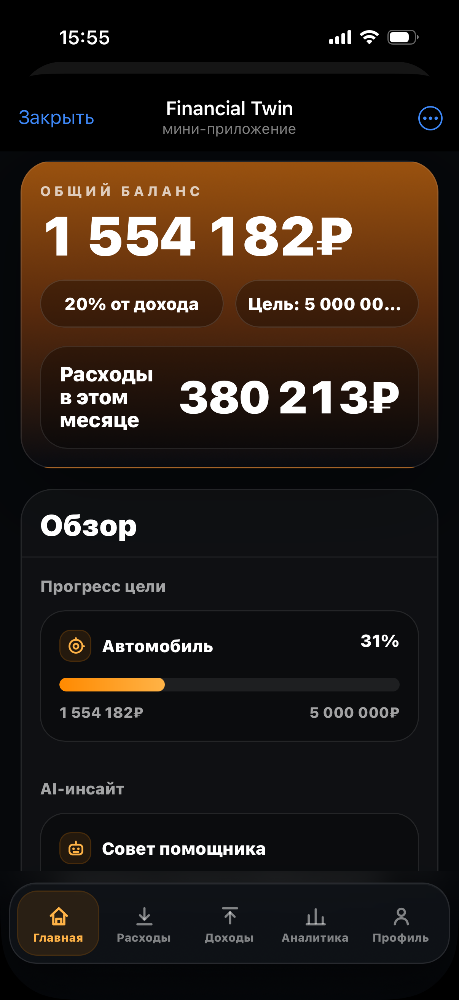
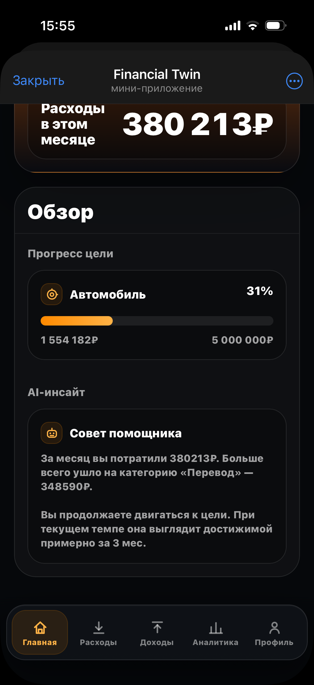
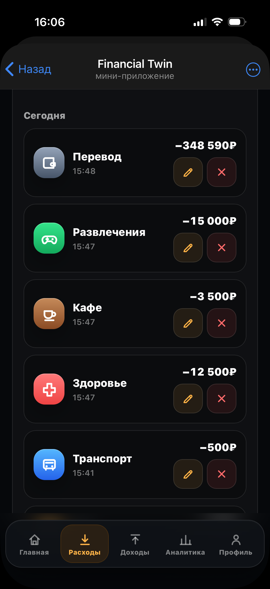
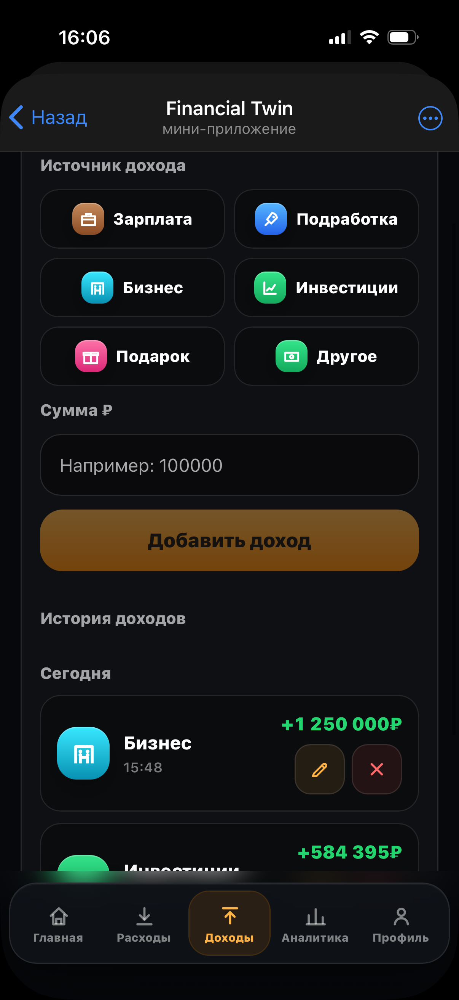
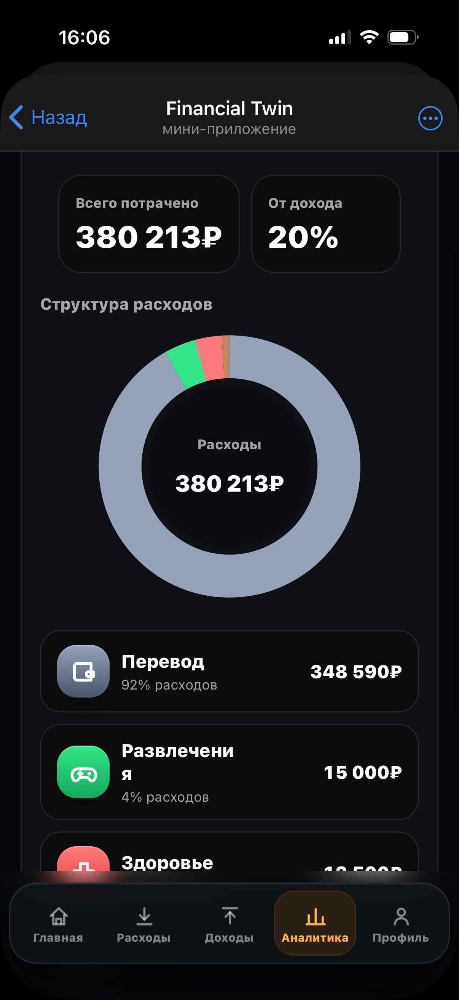
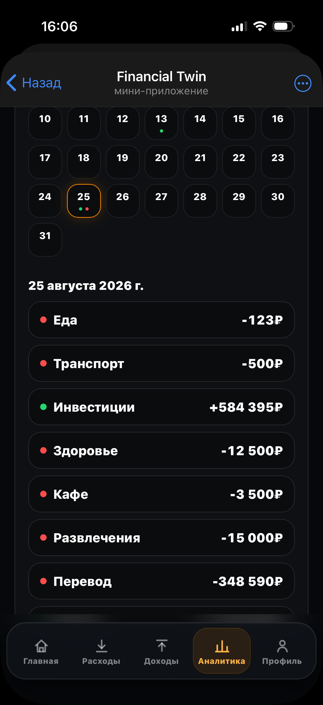
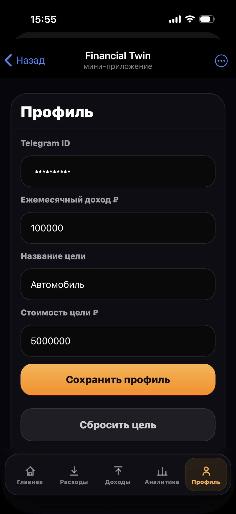

# Financial Twin

[English](README.md) | [Русский](README.ru.md)

**Персональный финансовый помощник в формате Telegram Mini App.**

> **Язык интерфейса:** русский  
> Financial Twin разработан для русскоязычной аудитории.

Financial Twin — полнофункциональный финтех-продукт для управления личными финансами непосредственно внутри Telegram.

Приложение объединяет учёт доходов и расходов, управление балансом, финансовые цели, аналитику и управление аккаунтом в едином интерфейсе.

> Этот репозиторий является публичной showcase-версией проекта.  
> Production-код, учётные данные, инфраструктурные секреты и пользовательские данные намеренно не публикуются.

---

## Обзор продукта

Financial Twin разрабатывался как полноценный продукт — от продуктовой логики и интерфейса до backend-архитектуры, проектирования базы данных, безопасности, развёртывания и production-инфраструктуры.

Текущая версия MVP охватывает основной сценарий управления личными финансами:

- учёт доходов;
- учёт расходов;
- текущий баланс;
- финансовую цель;
- аналитику;
- историю операций;
- финансовый календарь;
- onboarding;
- управление аккаунтом и конфиденциальностью.

---

## Основные возможности

### Личные финансы

- Управление доходами
- Управление расходами
- Автоматический расчёт баланса
- Финансовая цель
- Ежемесячная аналитика
- История операций
- Финансовый календарь

### Интеграция с Telegram

- Интерфейс Telegram Mini App
- Аутентификация пользователя через Telegram
- Защищённые API-запросы
- Доступ только к данным текущего пользователя

### Аккаунт и конфиденциальность

- Onboarding пользователя
- Управление профилем
- Изоляция персональных данных
- Удаление аккаунта
- Настройки конфиденциальности

---

## Архитектура

```text
Telegram
   │
   ▼
Telegram Mini App
   │
   ▼
HTML / CSS / JavaScript
   │
   │ REST API
   ▼
FastAPI
   │
   ├── Аутентификация
   ├── Бизнес-логика
   ├── Валидация
   └── Изоляция пользователей
   │
   ▼
SQLAlchemy
   │
   ▼
PostgreSQL
```

### Production-инфраструктура

```text
Клиент
   │
   │ HTTPS
   ▼
Nginx
   │
   ▼
FastAPI / Uvicorn
   │
   ▼
PostgreSQL
```

---

## Технологический стек

### Backend

- Python
- FastAPI
- SQLAlchemy
- Pydantic
- PostgreSQL
- Alembic

### Frontend

- HTML
- CSS
- JavaScript
- Telegram Mini Apps API

### Инфраструктура

- Linux
- Nginx
- Uvicorn
- VPS
- HTTPS
- Git
- GitHub

---

## Безопасность

Безопасность Financial Twin рассматривается как часть архитектуры продукта, а не как отдельное дополнение после разработки.

Реализованы:

- проверка Telegram-аутентификации;
- защищённые API-endpoints;
- изоляция пользовательских данных;
- проверки принадлежности ресурсов пользователю;
- валидация входных данных;
- хранение секретов через переменные окружения;
- хранение credentials вне исходного кода;
- HTTPS;
- настройки конфиденциальности;
- сценарий удаления аккаунта.

Чувствительная production-информация намеренно исключена из этого публичного репозитория.

---

## Инженерная часть

Financial Twin включает не только основную финансовую функциональность.

В рамках проекта также реализованы:

- миграции базы данных и управление изменениями схемы;
- backend-валидация и обработка ошибок;
- loading-, empty-, error-, success- и disabled-состояния интерфейса;
- Telegram-аутентификация и навигация;
- адаптация под экранную клавиатуру и safe area;
- инфраструктурная конфигурация;
- подготовка резервного копирования и восстановления;
- production deployment;
- внутренний QA перед закрытой beta.

---

## Статус проекта

**MVP v0.1.0**

MVP включает полный базовый сценарий управления личными финансами и развёрнут на production-инфраструктуре.

Текущая реализация включает:

- доходы и расходы;
- автоматический расчёт баланса;
- финансовую цель;
- аналитику;
- календарь;
- Telegram-аутентификацию;
- onboarding;
- изоляцию пользовательских данных;
- конфиденциальность и удаление аккаунта;
- production-инфраструктуру.

---

## Демонстрация продукта

Financial Twin разработан как mobile-first Telegram Mini App с тёмным интерфейсом и единой визуальной системой для основных сценариев управления личными финансами.

### Главный экран

<p align="center">
  
  
</p>

Главный экран показывает текущий баланс, расходы за месяц, прогресс финансовой цели и персональный финансовый совет.

### Ежедневное управление финансами

<p align="center">
  
  
  
</p>

Пользователь может управлять доходами и расходами по категориям, просматривать историю операций и анализировать структуру своих расходов.

### Аналитика и аккаунт

<p align="center">
  
  
</p>

Финансовый календарь связывает операции с конкретными датами, а раздел профиля позволяет управлять финансовой целью и настройками аккаунта.

---

## Политика публичного showcase

Основной репозиторий разработки Financial Twin является приватным.

Этот публичный репозиторий предназначен для демонстрации:

- концепции продукта;
- функциональности;
- архитектуры;
- технологического стека;
- инженерного подхода;
- UI/UX;
- объёма выполненной разработки.

В репозитории намеренно отсутствуют:

- production credentials;
- `.env`-файлы;
- пароли базы данных;
- Telegram-токены;
- приватные инфраструктурные конфигурации;
- дампы базы данных;
- пользовательские данные;
- production-логи;
- внутренний production-код.

---

## Развитие showcase

Публичная презентация проекта будет дополняться:

- архитектурными диаграммами;
- технической документацией;
- историей развития продукта;
- отдельными инженерными решениями.

---

## Автор

**Tamerlan Ismailov**

Студент направления «Бизнес-информатика», занимаюсь backend-разработкой и созданием цифровых продуктов.

[GitHub-профиль](https://github.com/tamerlanismailov)
